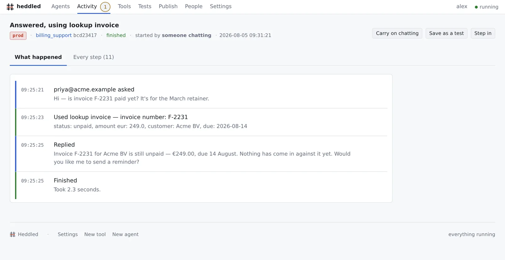

<h1>
  
  Heddled
</h1>

A self-hostable agent platform where **building, debugging, operating and evaluating** an agent are all views on the same event stream.

Easy enough to ship an agent in an afternoon, powerful enough to run a fleet in production. No SPA, no build step, no message broker — Python, Flask and SQLite.

[](https://github.com/heddled/heddled/actions/workflows/ci.yml)
[](https://www.python.org/downloads/)
[](LICENSE)

[**heddled.com**](https://heddled.com) · [**Documentation**](https://heddled.com/docs.html)

<picture>
  <source media="(prefers-color-scheme: dark)" srcset="docs/console-dark.webp">
  
</picture>

```
heddled dev                                          # console + live trace pane
heddled chat support "where is invoice F-2231?"      # one scripted turn
heddled tool test lookup_invoice --args '{"invoice_number":"F-2231"}'
```

---

## Why

Low-code builders are approachable until you need real tools, real visibility, or a human in the loop. Code frameworks are powerful but hand you a library, not a product — you build the console, the traces, the deployment story and the operator experience yourself, every time.

Heddled has **one spine**: a structured event stream every turn flows through. Everything else is either an **adapter** (moves messages in/out — tools and channels alike) or a **consumer** (observes the stream — trace viewer, console, eval runner). When the spine is right, the features bolted on elsewhere fall out naturally here.

## Install

One command. It checks for Docker, offers to install it if it is missing, fetches Heddled and starts it on http://localhost:5005:

```bash
curl -fsSL https://heddled.com/install.sh | sh      # macOS, Linux
irm https://heddled.com/install.ps1 | iex          # Windows, in PowerShell
```

Both are plain files — read them first if you would rather. They ask before installing anything and refuse to write over an existing checkout. `HEDDLED_DIR`, `HEDDLED_PORT` and `HEDDLED_REPO` change where, which port, and which fork.

To work on Heddled itself rather than run it:

```bash
pip install -e .          # gives you the `heddled` command
heddled init                 # scaffold an example agent + tools
heddled dev                  # console on http://localhost:5005
```

Or run it straight from a checkout with no install step at all:

```bash
./heddled-cli dev
```

### Self-host

```bash
docker compose up         # console, API, trace store, worker — the whole platform
```

`agents/` and `tools/` are bind-mounted from the checkout, so editing a file on the host takes effect immediately and `git diff` still tells the truth. To run the worker as its own process:

```bash
HEDDLED_WEB_ONLY=1 docker compose --profile split up
```

## An agent is one file

```yaml
# agents/support.yaml
name: support
model: anthropic/claude-sonnet-4-6        # provider-agnostic
instructions: ./support.md

adapters:
  channels: [webchat, webhook]
  tools: [lookup_invoice, create_ticket, refund]

triggers:
  - schedule: "0 8 * * 1-5"               # every weekday 08:00
    message: "Summarize overnight invoices and flag anything unpaid."
  - poll: mailbox                          # check a source, fire per new item
    every: 60s
    on_new: "Handle this incoming invoice email."

policies:
  - tool: refund
    requires_approval: true                # pauses the turn, routes out of Heddled
    budget: { max_eur_per_day: 500 }
  - tool: "*"
    redact: [iban, creditcard]             # applied at the trace-store boundary

memory:
  session: auto

expose:
  mcp: true                                # serves ask_support at /mcp/support
```

A tool is one directory — a schema and a handler, testable in isolation:

```yaml
# tools/lookup_invoice/tool.yaml
name: lookup_invoice
description: Look up an invoice by number; returns status and amount.
input:  { invoice_number: string }
output: { status: string, amount_eur: number }
handler: ./handler.py
```

```python
# tools/lookup_invoice/handler.py
def handle(args, ctx):
    ctx.log(f"looking up {args['invoice_number']}")
    return {"status": "unpaid", "amount_eur": 249.0}
```

## Authoring

You never have to write that first YAML file by hand. Both surfaces call the same scaffolds, so they cannot drift:

```bash
heddled new agent support --model anthropic/claude-sonnet-4-6
heddled new tool lookup_invoice --input invoice_number:string --output "status:string,amount_eur:number"
heddled new policy support --tool refund --requires-approval
heddled new agent triage --from support        # most second agents are a variation on the first
```

…and the console's **New agent** / **New tool** buttons do the same thing. Every agent and tool page has a **Form** tab and a **Raw file** tab — two views of one document. The form knows the schema, so mistakes like mounting a tool that doesn't exist are unreachable rather than diagnosed; the raw tab is always one click away, so the form is never a ceiling.

Saving writes the file, and only the file:

- Comments, key order and formatting survive — a one-field edit produces a one-line diff.
- Validation runs *before* the file is touched; a rejected save returns your text with the reason, never a half-written file.
- Anything the form can't represent faithfully (anchors, merge keys) is detected, and the form goes read-only rather than silently dropping it.
- Deleting warns about what depends on it first — the Tools screen shows every agent a change would reach, because the registry is global.

Because the registry re-reads from disk, a change is live on the next turn. No restart, no deploy step.

Turn on **commit on save** in Settings and each edit becomes a commit, so `git log` is the change log. It ships off — Heddled writes files; whether they become commits is your call.

## Three levels, no rewrites

1. **YAML** — the agent above.
2. **YAML + Python handlers** — drop to code when a tool needs logic.
3. **Python API** — when the default loop isn't enough, implement the turn engine yourself by subclassing `TurnEngine`. Point `handler:` at your class, as a path relative to the agent file or as an importable module:

```yaml
handler: ./triage_engine.py:TriageEngine     # files first
handler: myproject.planner:PlanningEngine    # or an installed package
```

It still emits the same events, mounts the same adapters, obeys the same policies and appears in the same console. A complete worked example — a deterministic triage pass in front of the model, with the approval gate and redaction still applying — is in [`examples/level3/`](examples/level3/).

Moving up a level never means abandoning the level below. A YAML-defined agent and a fully programmatic one are the same object to the platform.

## The trace is the product

Every turn is a sequence of structured events on one versioned contract:

```
trigger.fired · message.received · context.built · model.invoked · model.responded
tool.called · tool.result · approval.requested · approval.resolved
operator.injected · message.sent · turn.completed · error.raised
```

Each carries `session_id`, `turn_id`, `agent_version` and a monotonic sequence number. Because the exact model context is captured in `context.built`, you can replay any turn against a modified agent version and diff the behaviour. The audit log isn't a feature — it's a query.

One trace-view component is reused in four places: the dev harness, live sessions (over SSE), historical replay, and eval diffs. `j`/`k` step events, `Enter` expands, and `/sessions/<id>#e-1234` addresses a single event.

## Humans in the loop, not in the tool

A tool flagged `requires_approval` pauses the turn and emits `approval.requested`. An **approval adapter** delivers it wherever the approver already works — a Slack message, a webhook into an existing ticketing flow, an email with signed approve/deny links. The answer comes back as `approval.resolved` and the turn resumes.

Approvers never open Heddled. The console carries a fallback approval view purely as a consumer of the same two events.

```bash
heddled approve                              # list what's pending
heddled approve a_3c28… --decision approved  # or click the link you were sent
```

## Triggers

**Push** triggers are just inbound channel adapters — a webhook POST, an MCP call, an inbound email. Nothing new is needed.

**Pull** triggers are Heddled doing the calling, and they live in the background worker:

- **schedule** — fire on cron.
- **poll** — check a mailbox, queue, folder or API on an interval and start a turn per new item.

A poller is stateful: its cursor is persisted in SQLite, so a restart resumes where it left off. `trigger.fired` is the first event of the session, so a scheduled run is as traceable and replayable as a user-driven one.

## Evals

Any recorded session can be promoted to a **golden trace**. An eval run replays its inbound messages against a candidate version with tools in mock mode, and reports whether the agent called the same tools with equivalent arguments and whether the answer passes its assertions (`exact`, `contains`, `regex`, `similar`, or LLM-`judge`).

```bash
heddled eval promote s_a20941fe…  --name "invoice lookup"
heddled eval run support
heddled deploy support prod       # gated on a green eval run for that version
```

## Versions and environments

An agent's **version** is the sha256 of its definition plus its instructions — edit either and you get a new version, with no version field to forget to bump. Every version Heddled sees is kept, so it can be compared with what you are editing now and put back if an edit turns out badly.

Publishing binds one of those versions to an environment, and that binding decides what actually runs:

| Environment | Runs |
|---|---|
| `dev` | the file you are editing — so a change is one save away from being testable |
| `staging`, `prod` | the version published there, and it keeps running it while you edit |

Work arriving from outside — a webhook, an MCP caller, an inbound email, a scheduled run — belongs to `HEDDLED_DEFAULT_ENV` (or the `default_env` setting) unless the caller sends its own `env`. It ships as `dev`; set it to `prod` once you are publishing deliberately, and editing an agent stops changing what your live traffic does. An environment with nothing published falls back to the working file, so this changes nothing until you publish.

**Activity** shows which environment each conversation ran in and which version it ran, because a trial run and real traffic are not the same thing and should not look alike.

## Multi-agent, inside and outside

**Inside**, an agent mounts as a tool on another agent — delegation is a `tool.called` event whose handler is another turn engine, with sub-sessions linked to their parent and depth/cycle protection:

```yaml
adapters:
  tools: [lookup_invoice, "agent:billing"]
```

**Outside**, the same idea crosses the platform boundary via MCP in both directions. Consume a third-party MCP server's tools:

```yaml
adapters:
  tools:
    - { mcp: { url: "https://example/mcp", name: "billing" } }
```

…or publish an agent as an MCP server with `expose: { mcp: true }`. An external orchestrator sees one typed tool; the call lands as a channel adapter and the full spine applies — your policies, your budgets, your approval gates, your audit log, even when someone else's frontend is driving.

### Caller identity

Issue a key per external caller (Settings → `mcp_callers`) and policies can key on *which* orchestrator is calling. The key names the caller, so nobody can rename themselves with a header:

```json
{ "key-abc": "copilot-studio", "key-def": "claude" }
```

```yaml
policies:
  - tool: lookup_invoice
    allow_callers: [copilot-studio]      # this caller only
  - tool: refund
    approval_callers: [copilot-studio]   # gate applies to them, not to internal use
```

The identity is recorded on the session, so a turn resumed days later is still evaluated against the caller that started it. A single shared `mcp_api_key` also works; with neither set the endpoint is open, which is fine for a homelab.

### OpenTelemetry

The spine is exportable as OTLP traces — one trace per session, one span per turn, child spans per model and tool call, with everything else riding along as span events. Set `otel_endpoint` in Settings (or `OTEL_EXPORTER_OTLP_ENDPOINT`) and restart. It is a consumer like any other: it observes the stream and can never affect it.

## CLI

| Command | What it does |
|---|---|
| `heddled dev` | console + live trace, opened on an agent's Test tab |
| `heddled serve` | console, JSON API, SSE stream, worker |
| `heddled worker` | background worker standalone (queue + pull triggers) |
| `heddled chat <agent> <msg>` | one scripted turn; `--trace` prints the events |
| `heddled trace <session>` | print a session's trace |
| `heddled sessions` | list sessions |
| `heddled agents` / `heddled tool list` | what's defined on disk |
| `heddled new agent <name>` | scaffold an agent; `--from <agent>` clones an existing one |
| `heddled new tool <name>` | scaffold a tool; `--input to:string --output sent:boolean` |
| `heddled new policy <agent>` | add a gate, budget or redaction rule |
| `heddled mv agent\|tool <old> <new>` | rename, following every reference to it |
| `heddled rm agent\|tool <name>` | delete, refusing if something still depends on it; `--force` unmounts it and deletes |
| `heddled tool test <name> --args` | run a tool in isolation |
| `heddled approve [id]` | list or resolve approvals |
| `heddled eval promote` / `heddled eval run` | golden traces and regression runs |
| `heddled deploy <agent> <env>` | promote a version, gated on evals |
| `heddled retention` | apply the context retention policy now |

## Configuration

Model keys and adapter settings live in **Settings** in the console (stored in SQLite), and fall back to environment variables:

| Variable | Purpose |
|---|---|
| `ANTHROPIC_API_KEY` | `model: anthropic/…` |
| `OPENAI_API_KEY`, `DEEPSEEK_API_KEY`, `GROQ_API_KEY`, `MISTRAL_API_KEY`, `TOGETHER_API_KEY`, `OPENROUTER_API_KEY` | one per service — `model: deepseek/deepseek-chat` reads `DEEPSEEK_API_KEY` |
| `<SERVICE>_BASE_URL` | point a service elsewhere: a proxy, a gateway, your own server |
| `HEDDLED_ROOT` | project root (agents, tools, data, var) |
| `HEDDLED_PORT` / `HEDDLED_HOST` | where the console listens |
| `HEDDLED_DEFAULT_ENV` | environment for work arriving from outside — decides which version it runs (default `dev`) |
| `HEDDLED_KEEP_FULL_CONTEXT_DAYS` | retention for full `context.built` payloads (default 90) |
| `HEDDLED_MAX_TOOL_ITERATIONS` | safety rail on the agent loop (default 12) |
| `HEDDLED_WEB_ONLY` | serve HTTP only; run `heddled worker` separately |
| `OTEL_EXPORTER_OTLP_ENDPOINT` | export the spine as OTLP traces |

`HEDDLED_ROOT` is otherwise found by walking up from the working directory to the nearest folder containing `agents/`, so `heddled` works from anywhere inside a project.

Every service that speaks the OpenAI chat-completions API is addressed by prefix and
carries its **own** key, so several can be configured at once:

| `model:` | Service | Key |
|---|---|---|
| `anthropic/claude-sonnet-4-6` | Anthropic | `anthropic_api_key` |
| `openai/gpt-4o` | OpenAI | `openai_api_key` |
| `deepseek/deepseek-chat` | DeepSeek | `deepseek_api_key` |
| `groq/llama-3.3-70b-versatile` | Groq | `groq_api_key` |
| `mistral/mistral-large-latest` | Mistral | `mistral_api_key` |
| `together/…` | Together | `together_api_key` |
| `openrouter/…` | OpenRouter | `openrouter_api_key` |
| `ollama/llama3.2` | Ollama on this machine | none needed |
| `vllm/<model>` | your own vLLM server | none needed |

Anything else OpenAI-compatible works too: set `<name>_base_url` and use `<name>/<model>`.

Use `model: mock/echo` to develop against a deterministic fake provider with no API key at all.

## Layout

```
agents/           agent definitions (YAML) + instructions (Markdown)
tools/<name>/     tool.yaml + handler.py
heddled/          the platform
  engine.py       the turn engine — resumable across approvals
  events.py       the event contract
  store.py        SQLite event + state store, job queue, cursors
  worker.py       drains the queue, ticks pull triggers
  policies.py     approval gates, budgets, rate limits, redaction
  triggers.py     cron + pollers
  evals.py        golden traces and eval runs
  registry.py     files-first loading of agents and tools
  otel.py         OpenTelemetry export — a consumer, nothing more
  authoring.py    create/edit/delete agents, tools, policies (CLI + console)
  yamlio.py       comment-preserving YAML round-trip
  gitio.py        optional commit-on-save
  adapters/       channels, approval adapters, pollers
  providers/      anthropic, openai-compatible, mock
  web/            Flask console, JSON API, SSE, MCP server
examples/starter/ an agent and three tools to copy into agents/ and tools/
examples/level3/  a worked custom turn engine
tools_dev/        checks the console the way a person would (Playwright)
tests/            the test suite
data/, var/       created on first run — gitignored
```

**`agents/` and `tools/` are gitignored.** They hold your definitions, and what you tell an agent to do is not something to publish by accident — so this repository ships none of them. The installer copies [`examples/starter/`](examples/starter/) in on a fresh install, `heddled init` writes a smaller set, and the console makes its own.

To version yours, keep them in a private repository or drop those two lines from `.gitignore` in your fork. Commit-on-save then works as intended, pointed wherever you point it.

Stored context is zstd-compressed (zlib on an interpreter without zstd). Each row records its own codec, so a store written by any build stays readable by any other.

## Contributing

```bash
git clone https://github.com/heddled/heddled && cd heddled
pip install -e ".[dev]"
pytest
```

CI runs the suite on Python 3.10 through 3.14, builds the image, and drives a full turn through a running container — so a change that only works on your machine fails before review.

Two things worth knowing before you open a pull request:

- **[`heddled-concept.md`](heddled-concept.md) is the design document.** It states the principles the code is answerable to — one event spine, files as the source of truth, self-hosting as the default. A change that contradicts it needs to argue with it, which is a fine thing to do in an issue.
- **Behaviour is tested through the surface that has it.** Console behaviour is tested through the Flask test client, not by calling functions underneath it, so a passing suite means the screen works. `tools_dev/` goes further and measures contrast, hit targets and overflow in a real browser.

## Non-goals

No visual flow builder. No connector marketplace. No built-in vector database (memory/RAG is a tool adapter interface — bring your own). No fine-tuning. No multi-tenant SaaS billing.

## License

Apache-2.0. See [LICENSE](LICENSE).
